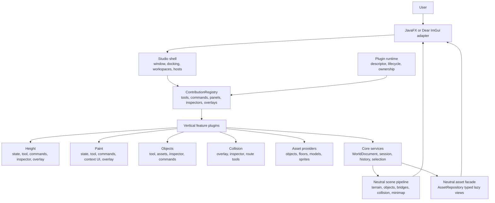

# OpenRune Studio plugin and feature architecture

Status: active architecture for first-party and third-party features. Studio
owns plugin lifecycle, contribution cleanup, isolated external JAR loading,
manifest/dependency resolution, repository feeds, verified installs, typed
inter-plugin extensions, and frontend-neutral declarative HUDs. The Dear ImGui
frontend projects those neutral contributions into the native Studio shell.

This document records the architecture decision prompted by the feature/plugin
proposal: a feature should own its behavior and UI contributions together,
while Studio owns the application shell that hosts those contributions.

The frontend-specific ImGui plan is recorded in
[`IMGUI_ADAPTER.md`](IMGUI_ADAPTER.md). It does not introduce a second
foundation or permit toolkit types to cross the plugin boundary.

The concrete JavaFX host and its controlled layout rules are recorded in
[`UI_UX_FOUNDATION.md`](UI_UX_FOUNDATION.md). Plugins contribute stable
metadata and factories; they do not replace the application frame or persist
workspace layout in project data.

## Decision

Use a vertical feature/plugin architecture.

A feature such as Height should be organized around one plugin boundary:

```text
features/height/
├── HeightPlugin
├── HeightTool
├── HeightToolState
├── HeightCommands
├── HeightContextContribution
├── HeightInspector
├── HeightOverlay
├── HeightShortcuts
└── HeightSettings
```

The names may be Java classes or packages rather than separate Gradle modules.
The important rule is ownership: code that changes the Height feature should be
near the Height feature, and all mutations still go through `EditorSession` and
canonical `EditorCommand` history.



The shell owns placement and lifecycle, not feature semantics:

| Studio owns | A feature/plugin owns |
| --- | --- |
| Main window and application frame | Feature state and behavior |
| Workspace switching and layout persistence | Tools and canonical commands |
| Viewport, inspector, bottom-drawer, and status hosts | Inspector sections and context-bar contributions |
| Menus, command palette, and focus policy | Shortcuts and command metadata |
| Plugin discovery, activation, ownership, and shutdown | Overlays, asset providers, and validation contributions |
| JavaFX/ImGui rendering resources | Neutral contribution metadata and frontend-independent logic |

This prevents the two failure modes we want to avoid: a feature split across
unrelated technical directories, and plugins that construct competing windows,
history stacks, scene graphs, or renderers.

### Cache selection is a startup boundary, not a feature plugin

The OSRS cache provider is not a Height, Objects, or Collision feature plugin.
`OsrsBundle` owns cache opening, revision/project identity, definition
services, and the transition from a cache-ready project into an
`EditorSession`. Feature plugins are mounted only after that transition. They
consume neutral assets and scene projections and must not initialize legacy
static loaders themselves.

The intended startup sequence is:

```text
launcher chooses OSRS bundle
  -> cache opens and revision identity is validated
  -> OsrsStudioProject creates session/document/assets
  -> feature EditorPluginHost initializes owned contributions
  -> JavaFX or Dear ImGui renders the same host
```

The current `ClientPlugin` OSRS implementation remains a compatibility bridge
for the legacy renderer. It now selects OpenRune FileStore for modern OSRS
reads; Displee remains limited to the 317 compatibility path and explicitly
staged output arrangements. It is not the model for feature ownership or
future external plugin permissions. This separation makes the OSRS cache
provider required for cache loading without making every feature plugin know
how cache startup works. FileStore is the backend implementation behind the
provider, not a contribution registered in `EditorPluginHost`.

### What selecting the OSRS plugin actually means

The user-visible choice is an OSRS format/provider selection, not a choice of
cache library. The selected bundle performs this sequence:

```text
OSRS provider selected
  -> detect revision and cache format
  -> open modern DAT2 data through CacheStoreFactory.openOsrs
  -> expose neutral archive identities and typed definitions
  -> create OsrsStudioProject / EditorSession
  -> mount feature plugins and frontend contributions
```

FileStore is therefore the source-of-truth reader for supported modern OSRS
caches. The OSRS provider is still necessary because FileStore does not decide
which archive is models, maps, skeletons, sprites, or revision-specific
terrain/location semantics, and it does not provide editor tools, history,
inspectors, overlays, or commands. Those responsibilities stay behind the
neutral RSPSi contracts. If the shell shows a selector, call it `Cache source`
and expose backend capabilities; do not expose FileStore as a feature-plugin
checkbox or advertise Displee as an equivalent modern decoder.

The existing `OSRSPlugin` is transitional: it installs revision-aware loader
adapters for the legacy renderer after the neutral cache has opened. It must
not become the place where the future editor owns world state or feature UI.
Modern OSRS is never routed through a guessed 317 layout; the explicit DAT2
index map and revision profile are part of the backend contract. A missing
modern texture or model is reported/falls back inside the compatibility
renderer, rather than causing FileStore or the neutral scene model to adopt a
317 interpretation.

The selectable bundle is represented by `OsrsBundle`. It composes the modern
`CacheStore`/FileStore project, `OsrsRevisionProfile`, neutral definitions and
assets, region/window/session creation, and feature-host startup.
`OsrsBundle.startFeatures(...)` is the explicit point after cache identity and
session creation where feature plugins become active.

OpenRune-Server integration is optional and capability-based. The neutral
`ServerAdapter`/`ServerBuildProvider` contracts describe project layout and
declarative build actions; `OpenRuneServerAdapter` contributes the current
`or-cache` tasks without importing OpenRune-Server or making it a cache-reader
dependency. `ServerBuildRunner` can execute those declared tasks from the
selected server root with streamed output and bounded timeout/cancellation
handling. Cache-only OSRS projects remain valid without a server checkout;
source application and a runtime bridge remain deferred.

## Contribution ownership

Every registration is owned by the active plugin context. A plugin does not
need to repeat its ID on every registration; the host records the contribution
set created during `start`/`initialize`.

The current neutral registry supports:

- tools;
- commands;
- panels and workspace metadata;
- inspector contributors;
- validators;
- viewport overlays; and
- keyboard shortcuts;
- typed tool-context settings with feature-owned getters/setters;
- asset-provider contributions;
- status contributions; and
- menu contributions that reference registered commands by ID.

`EditorPluginHost` validates each `EditorPluginDescriptor`, resolves declared
dependencies with stable load-order/ID tie-breaking, initializes plugins in
that order, shuts them down in reverse order, removes their contribution IDs,
and releases the plugin instances. `EditorPluginContext.track(...)` places
plugin-owned `AutoCloseable` resources into a host-owned LIFO bucket, so event
subscriptions, file watchers, executors, textures, GPU handles, and future
external-plugin classloader adapters cannot outlive the host. A failed startup
also rolls back contributions/resources from the failing plugin and shuts down
already-started plugins. Once the host closes, the registry rejects new
registrations even if a plugin retained its context.
This is the first-party version of the ownership cleanup used by
OpenRune-Server plugin reloads.

The JavaFX shell now mounts feature-owned typed settings for the active plugin
tool, inspector sections, asset providers, status values, command menu entries,
and a command palette. The immutable `EditorSceneSnapshot` also exposes
per-tile `EditorSceneTileProjection` values so scene plugins do not need to
reconstruct object layers or bridge context from global lists. The remaining
work is the equivalent Dear ImGui surfaces
plus custom editor/workspace contributions for larger editors
such as interfaces or cutscenes. The contracts are deliberately host-shaped
rather than toolkit-shaped.

`EditorFrontendFrame` and `EditorFrontendProjection` provide the immutable
frontend projection used by both hosts. `DearImGuiFrontendAdapter` translates
input through the shared `EditorInputRouter` and reads the same session,
selection, history, scene snapshot, and contribution IDs. It contains no ImGui
or graphics-library import; native draw submission belongs in the `Editor`
frontend module.

The terrain, object, and selection reference plugins now demonstrate the
intended state ownership. `TerrainToolSettings` owns terrain paint/shape/brush
values, `ObjectToolSettings` owns placement/rotation/snap values, and
`SelectionToolSettings` owns transform/replacement values. Their tool-context
contributions expose those values as `EditorSetting` metadata, and each tool
factory applies the same state when creating a tool instance. JavaFX therefore
does not carry a second feature-settings copy, and a future ImGui host can
render the exact same bindings.

These are not permission to pass JavaFX, Dear ImGui, OpenGL, or raw cache
objects into plugins. They are neutral descriptions or callbacks consumed by a
frontend adapter.

## Shared state and generated settings

The active tool, context UI, inspector, and overlay should read the same
feature state object. There should be one `radius`, one `mode`, and one
`falloff`, not separate toolbar/UI/tool copies synchronized by listeners.

Simple settings should eventually be described by neutral property metadata:

```text
HeightSettings
├── mode: enum(RAISE, LOWER, SMOOTH, SLOPE)
├── radius: integer 1..32
├── strength: integer 1..16
└── falloff: enum(HARD, LINEAR, SMOOTH)
```

JavaFX and Dear ImGui can render the same schema. Specialized controls remain
custom frontend contributions for cases such as a tile-shape palette, asset
thumbnail grid, interface canvas, or cutscene timeline.

## Shared shells for assets and inspection

Studio should own one Asset Browser and one Inspector shell. Plugins contribute
providers and sections; they do not each build a competing browser or giant
object inspector.

The current `AssetRepository` is now the neutral typed lazy facade for objects,
floors, textures, models, map-scene sprites, sequences, map elements, object
appearance, and object collision. A provider contribution can extend the
catalog later without making Studio plugins decode archives.

The Inspector should compose sections from plugin contributions, for example:

```text
INSTANCE       Map/Object feature
DEFINITION     OSRS asset feature
COLLISION      Collision feature
RENDER DEBUG   Renderer/debug feature
```

Disabling a plugin removes its section through ownership cleanup; the shell
continues to function.

## Frontend consequences

Dear ImGui does not change the foundation model. It is another consumer of the
same session, command/history, selection, scene snapshot, asset facade, and
contribution catalog. It owns draw lists, textures, docking state, and native
input translation. It does not own world identity, cache writes, collision
truth, a second renderer model, or a second undo stack.

The plugin-facing `EditorSceneSnapshot` is immutable and intentionally does not
expose the mutable `WorldDocument` held by the renderer-facing `RenderScene`.
Both JavaFX and Dear ImGui can therefore render the same semantic scene without
giving a plugin a mutation back door.

## External ecosystem contract

The managed plugin path is intentionally small and stable:

```text
repository feed
  -> ExternalPluginManifest
  -> semantic dependency resolution
  -> SHA-256 verified artifact
  -> IsolatedPluginClassLoader
  -> EditorPluginHost
  -> PluginApi / PluginServices
  -> disposable contributions and resources
```

Third-party tools should prefer `PluginApi` and `PluginServices`. The shared
service facade covers terrain/object/selection/brush/tool/command/UI operations,
typed editor events, declarative viewport HUDs, decoded cache-data discovery,
region-corpus feature extraction, and a generic typed extension registry.
`EditorExtensionRegistry` is the escape hatch for new families such as layer
codecs, map-piece libraries, WFC solvers, inpainting engines, exporters, path
policies, placement policies, and world-map writers. A new system therefore
does not require a new frontend hook simply to become pluggable.

`DecodedDataCatalog` separately records two facts: what FileStore/cache
decoders report as available, and which families currently have a neutral typed
provider. That distinction lets analytics/WFC tooling discover broad cache
coverage without leaking backend objects into plugins or pretending every
decoded family already has a stable editor contract.

Declarative HUD contributions use `OverlayComponent` trees and
`OverlayContribution` metadata. Plugins choose content, position, layer, and
priority; Studio owns fonts, colors, spacing, collision-free placement, and the
Dear ImGui projection. Direct ImGui imports remain outside the plugin API.

## Packaging and loading policy

Keep vertical feature packages inside a small number of meaningful Gradle
modules. Do not create one module per feature. A reasonable eventual topology
is:

```text
studio-core        sessions, commands, world, scene, neutral APIs
studio-plugin-api  plugin descriptors, contributions, lifecycle contracts
studio-osrs        cache and OSRS adapters
studio-render      renderer adapters
studio-features    built-in vertical feature plugins
studio-app         JavaFX/ImGui shell and frontend adapters
```

The current repository maps these responsibilities across `Client`, `Editor`,
and `Plugins`; the package boundary is the immediate concern, not a Gradle
rename. Built-in features should use the same plugin API as external plugins.

External JAR discovery is now a managed runtime rather than a raw ServiceLoader
directory scan. A managed JAR carries `META-INF/rspsi-plugin.json`; the
runtime validates semantic versions and plugin-API compatibility, resolves
required/optional dependencies, selects the newest installed release of each
plugin, creates one isolated classloader per artifact, and unloads those
classloaders with the host. Manifest-less JARs remain a compatibility path and
do not participate in dependency/update resolution.

Repository feeds are versioned JSON indices. Downloads are staged, SHA-256
verified, and atomically installed before Studio rescans the plugin directory.
The Plugin Manager can add/remove repository URLs, refresh feeds, install or
update releases, and rescan JARs without reloading the active map document.

Classloader isolation is an ownership and dependency boundary, not a security
sandbox. Manifest permissions are currently metadata surfaced in Plugin
Manager and must not be described as JVM-level containment until service-level
permission enforcement is implemented.

## What is adopted now versus deferred

Adopt now:

- feature-owned logic/state/commands/UI contributions;
- shell-owned hosts and placement;
- explicit contribution ownership and automatic cleanup;
- host-owned resource cleanup and closed-registry protection;
- neutral typed asset access;
- immutable plugin-facing scene snapshots;
- built-in plugins exercising the same API as future external plugins; and
- one shared state object per feature.

Defer until the foundation and core map workflow are accepted:

- a curated/signature-backed public Plugin Hub beyond generic repository feeds;
- Lua/CS2 scripting and service-level permission enforcement;
- class redefinition/live code swap inside an already-instantiated plugin;
- a full custom-editor workspace API; and
- a Dear ImGui migration or renderer replacement.

## Implementation sequence

1. Finish the semantic foundation and parity evidence for the OSRS scene
   pipeline.
2. Keep the built-in terrain/object/selection plugins as the reference set
   while extracting vertical `Paint`, `Height`, `Collision`, and
   `Validation/Debug` feature packages.
3. Add the tool-context host, inspector section host, asset-provider host, and
   status host as neutral contribution types. These are implemented and
   mounted in the JavaFX shell.
4. Move each feature's existing commands and state beside its plugin without
   changing command/history ownership.
5. The JavaFX shell now consumes the contribution hosts; implement Dear ImGui
   as a second adapter only after the host contracts have interactive evidence.
6. Revisit external JAR runtime choices only after built-in lifecycle and
   ownership tests are stable.

The governing rule is: the plugin owns the feature; Studio owns the framework
in which the feature appears.

## Cache and workspace boundary

The OSRS cache provider is not a feature plugin. `OsrsBundle` selects the
FileStore-backed cache and creates the session-scoped definitions/assets before
feature plugins start. Workspaces such as Map, Interface, Item, and Model use
the same session, command history, selection, asset repository, diagnostics,
and renderer contracts. A workspace may contribute tools, panels, inspectors,
and overlays, but it may not open caches, own a second world model, or create a
second history/plugin registry.

## Server integration is not server-plugin loading

The built-in `OpenRuneServerAdapter` integrates a user-selected OpenRune
checkout through inspection and declared build tasks. OpenRune's built-in
`PluginPack` modules and external `plugins/` entries are inventoried for
provenance and diagnostics, but Studio never executes their classes or loads
their Guice/server runtime. This preserves the neutral Studio plugin boundary
while still allowing a future server-side runtime bridge to negotiate explicit
capabilities.

## Renderer diagnostics contribution

RuneLite DevTools is represented as one grouped first-party contribution,
`rspsi.tools.renderer-debug`. It consumes the immutable `EditorSceneSnapshot`
and may expose IDs, shapes, rotations, bridges, flags, collision, route, LOS,
camera, occluder, and layer-order diagnostics.

Persisted `UserTileMarker` values are project data. Temporary IDs, hover
labels, collision previews, and scene warnings are
`DiagnosticTileAnnotation` values and are regenerated from the current scene.
Neither class opens a cache or mutates the authored world.

The contribution uses the same lifecycle cleanup as every other built-in
plugin. Unloading it removes its overlay registration and any tracked
resources without touching the session, renderer scene, or history.
