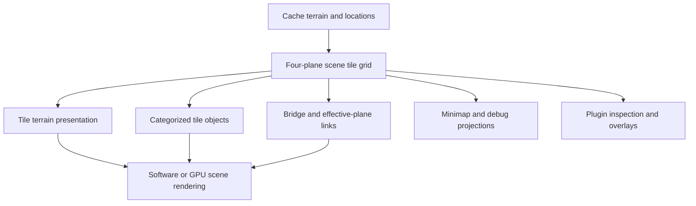

# RuneLite Scene Reference for OpenRune Studio

This document records the concrete scene model observed in the pinned
`melxin/runelite` checkout. It is a behavior and vocabulary reference for
RSPSi's neutral scene contracts, renderers, inspectors, and plugins. It is not
permission to copy the RuneLite client, cache module, injected client, or
renderer into Studio.

Reference checkout:

- repository: <https://github.com/melxin/runelite>
- local path: `../RSPSi-resources/RuneLite-melxin`
- commit: `1ad572d7dcdbc0fb67a4a00f0c2f959d5ab25abc`
- declared license: BSD-2-Clause

## The scene is a layered runtime projection

The most important conclusion is that an OSRS scene is not synonymous with a
mesh or a cache region. RuneLite exposes and renders several related layers:



RSPSi therefore keeps the editable `WorldDocument` authoritative and exposes
derived scene views. A plugin may ask for terrain topology, object categories,
effective planes, collision, or a render projection, but it must not make a
second mutable scene graph the source of truth.

## Source map

| Concern | RuneLite reference paths | RSPSi implication |
|---|---|---|
| Public scene vocabulary | `runelite-api/.../Scene.java`, `Tile.java`, `SceneTilePaint.java`, `SceneTileModel.java` | Define neutral scene access around planes, tiles, terrain presentation, and object categories |
| Client-facing bridge | `runescape-api/.../RSScene.java`, `RSTile.java`, `RSSceneTilePaint.java`, `RSSceneTileModel.java` | Keep implementation/client handles behind adapters; do not expose them to editor plugins |
| Runtime scene behavior | `runescape-client/src/main/java/Scene.java`, `Tile.java`, `CollisionMap.java`, `ObjectComposition.java`, `Rasterizer3D.java`, `ModelData.java` | Use as focused behavior references for scene construction, collision, and model inputs |
| Scene hooks and visibility | `runelite-mixins/.../RSSceneMixin.java`, `RSTileMixin.java` | Record effective-plane, bridge, roof, draw, and object lifecycle rules as neutral semantics |
| GPU scene projection | `runelite-client/.../plugins/gpu/SceneUploader.java` | Use upload order and model attributes to guide renderer parity tests |
| Debug tooling | `runelite-client/.../plugins/devtools/SceneOverlay.java` and related DevTools classes | Recreate useful inspectors and overlays against immutable Studio snapshots |
| External plugin platform | `runelite-client/plugins`, PF4J/classloader/plugin manager paths | Inform later external-plugin lifecycle and ownership work, not scene storage |

## Scene data model

### Scene container

RuneLite's public `Scene` exposes a `Tile[][][]` scene grid, tile heights,
tile settings, base coordinates, instance state, packed instance template
chunks, and map-region identifiers. The ordinary scene is four planes over the
104×104 scene coordinate range. The scene base converts local scene positions
to world positions; it is not the same thing as a region or a source map
archive.

An instance scene adds a second mapping:

```text
destination scene plane/chunk
        -> packed source plane/region/chunk/rotation
        -> source authored terrain and locations
```

The destination scene is what the client renders, while the source mapping is
needed to explain provenance, edit behavior, and generated heights. RSPSi's
`InstanceChunkTransform`, `InstanceChunkGrid`, and `InstanceWorldBuilder`
already preserve this distinction.

### Tile contents

The public `Tile` contract separates:

- `SceneTilePaint`, a flat tile presentation with corner colors, texture, and
  flatness information;
- `SceneTileModel`, a shaped tile presentation with vertices, faces, shape,
  rotation, corner underlay/overlay colors, triangle colors, textures, and
  flatness information;
- one `WallObject`;
- one `DecorativeObject`;
- one `GroundObject`;
- an array of `GameObject` entries; and
- an optional bridge tile.

That separation is meaningful. A tile can have authored underlay/overlay
values without yet having a particular render representation, and an object
category is not interchangeable with a minimap sprite or a generic location
record.

The neutral Studio scene contract should preserve these distinctions as
read-only derived values:

```text
SceneTileSnapshot
├── authored coordinate / world coordinate / plane
├── render plane / physical plane / bridge relation
├── terrain presentation: paint OR shaped model inputs
├── objects: wall, wall decor, ground, ground decor, game objects
└── diagnostics: collision, visibility, provenance, asset capabilities
```

The editable location remains the canonical identity for save, selection, and
commands. The scene snapshot is a projection used by renderers and tools.

## Terrain and object phase order

The pinned `SceneUploader.uploadZoneTile` provides a concrete renderer phase
order for a tile:

1. scene tile paint;
2. scene tile model;
3. wall object;
4. decorative/wall-decoration object;
5. ground object;
6. game objects in the tile's object array; and
7. the linked bridge tile, recursively.

This is a renderer upload order, not a universal depth-sort rule. It is still
valuable because it identifies the stable semantic categories that a scene
renderer, object inspector, minimap composer, and plugin overlay must all
understand. RSPSi's minimap parity work now explicitly sorts overlapping map
scene contributions by the same semantic category order before rasterizing.

The GPU uploader also consumes model vertex/face arrays, face colors,
textures, alpha, priorities, and model transforms. Those inputs belong in the
render projection and asset facade; they do not belong in the authored map
document.

## Planes, bridges, and visibility

RuneLite distinguishes the tile's array plane from its physical/render level.
`Tile.getBridge()` links a tile to a related tile on another level, while
`getPhysicalLevel()` and `getRenderLevel()` describe where the tile is treated
for visibility and presentation.

`RSSceneMixin` and `RSTileMixin` show several consequences:

- bridge flags in tile settings can lower the effective plane used by scene
  drawing and object handling;
- roof and visibility checks compare the tile's physical level with the
  active scene plane;
- object insertion and removal adjust object plane/render-level state when a
  bridge flag is present; and
- underlay, overlay, minimap, and GPU paths must use compatible effective
  plane rules even though their output formats differ.

For Studio this means:

- authored plane is immutable source data;
- effective/render plane is derived context;
- bridge links are explicit scene relationships;
- collision and visibility may consult effective plane; and
- a frontend must never “fix” a bridge by rewriting the authored location or
  terrain plane.

This is the same rule captured by `WorldDocument.effectivePlane` and the
bridge-aware scene/collision builders.

## Minimap and debug projections are separate consumers

The replacement `drawTileMinimap` path in `RSSceneMixin` demonstrates that a
minimap is another projection of the scene, not a source of scene truth. It
uses tile shape and rotation tables, terrain corner lightness, textures, and
object/map-scene contributions. It does not replace the tile/object model.

The DevTools scene overlay similarly reads scene coordinates, map squares,
chunks, world points, tile polygons, object areas, and line-of-sight/route
visuals without becoming the owner of scene state.

Studio should follow that pattern:

- `EditorSceneSnapshot` is the shared read-only projection;
- `EditorSceneTileProjection` groups the authored tile, effective plane,
  bridge relation, terrain outputs, collision, and renderer-ordered objects;
- minimap, 3D render, collision, route, selection, and debug overlays are
  separate consumers;
- each consumer may have presentation-specific caches; and
- none may write pixels, GPU buffers, or overlay geometry back into the
  authored document.

## Plugin API consequences

The scene reference gives us a concrete plugin boundary instead of a vague
“render hook.” Future plugins should attach at one of these levels:

| Plugin need | Neutral contribution |
|---|---|
| Inspect terrain shape, heights, or materials | `EditorSceneOverlay` or `EditorInspector` over `EditorSceneSnapshot` |
| Inspect wall/ground/game-object category and footprint | object inspector/overlay using definition-backed scene access |
| Show bridge/effective-plane relationships | bridge diagnostic overlay and validator |
| Test route, reach, or line of sight | collision/route service and immutable preview result |
| Add a render backend | renderer adapter consuming `RenderScene`/scene snapshots |
| Add an asset-aware tool | typed `AssetRepository` plus command-backed `EditorTool` |
| Inspect a live client/server | later runtime adapter returning Studio-neutral scene facts |

A Height plugin should own height commands, settings, and its context UI. It
should consume the same scene snapshot as the renderer. An Object plugin
should own placement and replacement commands, but it should use shared object
definitions, footprints, category semantics, and collision projections. A
Collision plugin should not decode locations again or maintain a parallel
flag map.

## What this reference changes in the roadmap

The full RuneLite fork makes the scene foundation more concrete, but it does
not expand the immediate product scope. The next foundation evidence should be:

1. complete the independent full-render or geometry comparison beyond the
   covered minimap fixtures;
2. preserve a scene-layer/order fixture for terrain, wall, decoration,
   ground, game-object, and bridge projections;
3. promote effective-plane and bridge facts into explicit immutable scene
   access consumed by overlays and tools;
4. add a normalized OpenRune/RuneLite collision comparison fixture when the
   cache/config compatibility issue is resolved; and
5. only then implement the Dear ImGui adapter and expand first-party feature
   plugins.

The reference supports the planned vertical plugin architecture and future
runtime bridge, but it does not justify adding a second client scene graph,
cache backend, or renderer before the current foundation gates close.

## 2026-09-17 RSPSi 3D scene gap audit

The pinned source review changes the priority of the next renderer work. The
terrain topology tables are no longer the main risk: RSPSi's
`TerrainMeshBuilder` already covers the RuneLite/TSPS shape and rotation
families. The missing work is the information and runtime behavior that turns
that topology into the same 3D scene the client draws.

| Fidelity area | RuneLite evidence | Current RSPSi state | Required next contract/work |
|---|---|---|---|
| Actual 3D presentation | `Scene.draw`, camera projection, tile traversal, and `SceneUploader` | `CanonicalSceneViewport` is a top-down semantic JavaFX preview; `SceneRenderer` has no canonical 3D implementation; legacy `SceneGraph` remains a compatibility path | Implement a renderer-independent render packet and one real 3D backend. Do not make the legacy renderer define the neutral scene |
| Terrain appearance | `SceneTilePaint` stores final corner HSL values, texture, flatness, and RGB; `SceneTileModel` stores per-face A/B/C colors and texture IDs | `TerrainMaterial` retains source IDs/RGB and `TerrainLight` retains a directional baseline, but faces do not carry final corner colors, UVs, or texture/flatness render data | Add final per-corner/per-face terrain colors, texture references, UV basis, flatness/hidden state, overlay blending, HSL/lightness, and texture-average-HSL handling |
| Terrain blending and lighting | `Rasterizer3D`, floor color construction, shaped tile color arrays, and shared scene lighting | Height normals and edge light values exist, but the client-equivalent floor color/blend derivation is not yet a render gate | Implement and fixture floor color derivation separately from topology; include neighboring tiles where shared light/blend behavior requires them |
| Object model selection | `ObjectComposition.getModelData(shape, orientation)` uses `modelIds` paired with `models`/object types | `ObjectDefinitionView` exposes model IDs but loses the model-type pairing; `RenderObject` stores IDs without resolving shape-specific geometry | Preserve model IDs plus model types and resolve the exact model set for each location shape/category/orientation |
| Object transforms | `ObjectComposition` applies rotation, `isRotated`, resize, offsets, recolor/retexture, ambient/contrast, contouring, transforms, and optional sequence animation | Appearance metadata is present, but the neutral scene does not yet emit transformed model geometry | Add a deterministic object appearance/transform stage against terrain heights, with varbit/varp transforms and static map-scene animation policy explicitly defined |
| Model geometry/materials | `Model`/`ModelData` carry face colors, alpha, render types, priorities, bias, textures, texture triangles, normals, bounds, and optional skeletal/effect data | `ModelGeometryView` currently carries positions, indices, colors, alpha, and texture IDs only | Expand the neutral model packet with render types, priorities, bias, texture-face mapping/texture triangles, normals/bounds, and a documented policy for skeletal, billboard, emitter, and particle data |
| Scene layers/order | `Tile` separates paint/model, boundary, wall decoration, floor decoration, game objects, item layer, and bridge; `SceneUploader` uploads these in a stable category order before backend sorting | `RenderScene` has terrain and a flat render-object list; category exists, but the full tile layer snapshot and renderer ordering contract are not complete | Add `SceneTileSnapshot`/ordered layers, including bridge recursion and optional item-layer policy, then test upload/order semantics independently of depth sorting |
| Visibility and occlusion | `Scene.projectScene`, `updateVisibleTilesAndOccluders`, `drawTile`, and occluder types 1/2/4 | No canonical camera frustum, tile visibility map, occluder activation, roof policy, or footprint-aware traversal exists in the neutral renderer | Add camera/visibility/occlusion inputs to the render packet; keep culling and presentation backend-neutral where possible |
| Alpha and priorities | GPU path separates opaque/alpha data and uses `FacePrioritySorter` for transparent/priority ordering | No canonical alpha buffer, face priority, face bias, or transparent sorting path | Preserve the attributes in model packets and define deterministic transparent/priority ordering before GPU implementation |
| Textures | GPU `TextureManager` uploads texture pixels, mipmaps, filtering, animation direction/speed, and material layers; `SceneUploader` computes model/terrain UVs | Texture definitions are available through the asset facade, but no renderer resource/UV/animation packet is consumed by a 3D backend | Add neutral texture assets/material packets and UV generation; leave sampler/GPU resources to the frontend/backend |
| Incremental rendering | GPU uploader builds/reuses 8×8 zones, includes neighboring zones for shared light/blending, and rebuilds dirty zones | Scene updates currently rebuild derived scene data; no renderer zone cache or packet invalidation contract is complete | Define zone/chunk packet ownership and dirty dependencies after the packet shape is frozen |

This establishes the practical target: **static revision-240 map-scene
fidelity first**. Dynamic sequences, players, item piles, particles, and
other runtime-only behavior should not block the first authored map renderer,
but their absence must be explicit in the packet capability report rather than
silently approximated.

The lowest-risk source reuse is already available in OpenRune FileStore:
`ModelType` contains the missing model arrays and texture-triangle metadata,
and `ObjectType` contains the object model-type pairing and transform fields.
RSPSi should expand its adapter-owned neutral views around those fields; it
should not let OpenRune types escape into the editor or use RuneLite's client
renderer as a production dependency.

### Ordered renderer completion plan

1. Freeze neutral `TerrainRenderPacket`, `ModelRenderPacket`,
   `SceneTileSnapshot`, `TextureAsset`, and camera/visibility contracts.
2. Complete terrain final colors/materials and exact object model selection and
   transforms using FileStore-backed definition views.
3. Build a static CPU scene projection and a real 3D backend against the same
   packets; keep JavaFX/ImGui as consumers, not owners of scene truth.
4. Add bridge-aware layer traversal, camera visibility, occluders, roofs,
   alpha, face priorities, UVs, and textures.
5. Add RuneLite/TSPS-backed geometry/material/render-packet fixtures before
   optimizing with zone caches or adding dynamic runtime entities.

## Open evidence gaps

This reference is not itself a parity pass. The following remain explicit
work:

- full 3D scene geometry/material/lighting parity, including model transforms,
  alpha, priorities, textures, and clipping;
- broader revision and multi-region scene fixtures;
- normalized bridge/effective-plane behavior across renderer, minimap,
  collision, and selection projections;
- authoritative OpenRune route/collision evidence for a compatible cache; and
- manual JavaFX and eventual Dear ImGui interactive smoke coverage.

These gaps remain tracked in
[`FOUNDATION_AUDIT_2026-09-17.md`](FOUNDATION_AUDIT_2026-09-17.md) and
[`ROADMAP.md`](ROADMAP.md). The reference is useful because it tells us what
to measure next without turning RuneLite into an unowned production layer.
